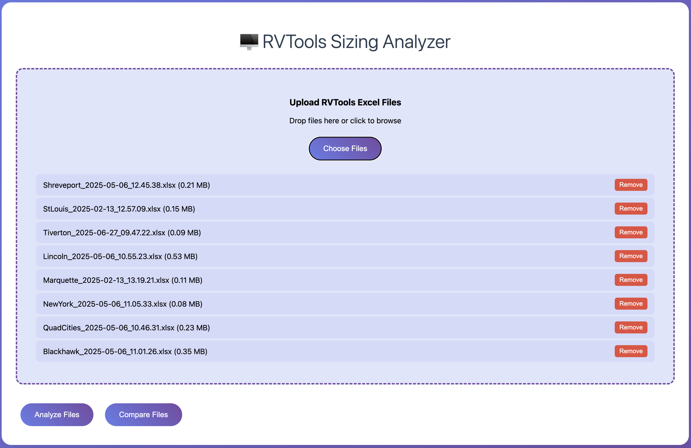

# RVtools-analyzer
RV Tools Analyzer is designed to take RVTools via upload and provide some analysis of utilization
- Designed for portability
- Designed for local path or upload


## Step 1 - Install Node
### For Ubuntu/Debian
```curl -fsSL https://deb.nodesource.com/setup_18.x | sudo -E bash -```
```sudo apt-get install -y nodejs```

### For CentOS/RHEL/Fedora
```curl -fsSL https://rpm.nodesource.com/setup_18.x | sudo bash -```
```sudo dnf install -y nodejs npm```

### Verify installation
```node --version```
```npm --version```

## Step 2 - Create App Directory

```sudo mkdir -p /opt/rvtools-analyzer```
```cd /opt/rvtools-analyzer```

### Set ownership (replace 'username' with your user)
```sudo chown -R $USER:$USER /opt/rvtools-analyzer```

## Step 3 - Install Dependencies
   ```npm install```

## Step 4 - Test the Installation
Test with a sample file (if you have one)

```node rvtools-analyzer.js /path/to/your/rvtools-file.xlsx```
```npm start```

## Step 5 - Deploy Webserver
### Install PM2 globally
```sudo npm install -g pm2```

### Start the application
```pm2 start rvtools-analyzer.js --name "rvtools-analyzer"```

### Save PM2 configuration
```pm2 save```

### Setup PM2 to start on boot
```pm2 startup```

### Check status
```pm2 status```
```pm2 logs rvtools-analyzer```

----------------------------
### Use systemd
# Create service file
```
sudo tee /etc/systemd/system/rvtools-analyzer.service << 'EOF'
[Unit]
Description=RVTools Analyzer
After=network.target

[Service]
Type=simple
User=your-username
WorkingDirectory=/opt/rvtools-analyzer
ExecStart=/usr/bin/node rvtools-analyzer.js
Restart=on-failure
RestartSec=5
Environment=NODE_ENV=production
Environment=PORT=3000

[Install]
WantedBy=multi-user.target
EOF

# Enable and start the service
sudo systemctl daemon-reload
sudo systemctl enable rvtools-analyzer
sudo systemctl start rvtools-analyzer

# Check status
sudo systemctl status rvtools-analyzer

```
## Step 6 - Configure Firewall Rules
   ### For Ubuntu/Debian (ufw)
```sudo ufw allow 3000/tcp```
```sudo ufw reload```

   ### For CentOS/RHEL (firewalld)
```sudo firewall-cmd --permanent --add-port=3000/tcp```
```sudo firewall-cmd --reload```

## Step 7 - Configure NGINX

## Install Nginx Ubuntu/Debian
```sudo apt update```
```sudo apt install nginx -y```  

### Install Nginx CentOS/RHEL/Fedora
```sudo dnf install nginx -y```    

## Create Nginx configuration
```
sudo tee /etc/nginx/sites-available/rvtools-analyzer << 'EOF'
server {
    listen 80;
    server_name your-server-ip-or-domain;

    client_max_body_size 100M;

    location / {
        proxy_pass http://localhost:3000;
        proxy_http_version 1.1;
        proxy_set_header Upgrade $http_upgrade;
        proxy_set_header Connection 'upgrade';
        proxy_set_header Host $host;
        proxy_set_header X-Real-IP $remote_addr;
        proxy_set_header X-Forwarded-For $proxy_add_x_forwarded_for;
        proxy_set_header X-Forwarded-Proto $scheme;
        proxy_cache_bypass $http_upgrade;
        proxy_read_timeout 300s;
        proxy_connect_timeout 75s;
    }
}
EOF
```
## Enable the site
```
sudo ln -s /etc/nginx/sites-available/rvtools-analyzer /etc/nginx/sites-enabled/
sudo nginx -t
sudo systemctl reload nginx
```

## View the User Interface

Open your browser and go to: ```http://your-server-ip``` (with Nginx) or ```http://your-server-ip:3000``` (direct)
### Upload your RVTools Excel files using the drag-and-drop interface


### Click "Analyze Files" for single file analysis or "Compare Files" for multiple files
### View the results with metrics and visualizations

